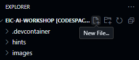

# Porozumění Completion API a API klíčům

V tomto workshopu budeme pracovat s Large Language Models (LLMs) prostřednictvím jejich API. Pojďme si vysvětlit, co jsou tyto API a jak k nim přistupovat.

## Co je Completion API?

Completion API vám umožňuje poslat dotaz (prompt) do AI modelu a získat vygenerovanou odpověď. Základní proces funguje takto:

1. Odešlete požadavek obsahující:
   - Váš API klíč pro autentizaci
   - Prompt nebo zprávu
   - Volitelné parametry (teplota, maximální počet tokenů atd.)

2. AI služba zpracuje váš požadavek

3. Služba vrátí odpověď s textem vygenerovaným umělou inteligencí

## Používání sdílených API klíčů

Pro tento workshop vám poskytneme sdílený API klíč pro přístup k modelům Azure AI. Tento přístup je běžný ve vývojových a testovacích scénářích.

```python
# Příklad: Použití sdíleného API klíče
import os
from openai import AzureOpenAI

# Použití sdíleného API klíče
client = AzureOpenAI(
    api_key="SHARED_KEY_WILL_BE_PROVIDED",  # Tento klíč vám poskytneme během workshopu
    api_version="2023-12-01-preview",
    azure_endpoint="https://workshop-endpoint.openai.azure.com/"  # Příklad koncového bodu
)

response = client.chat.completions.create(
    model="gpt-35-turbo",
    messages=[
        {"role": "system", "content": "Jste nápomocný asistent."},
        {"role": "user", "content": "Vysvětlete kvantové počítání jednoduchými slovy."}
    ]
)

print(response.choices[0].message.content)
```

> ⚠️ **Důležité**: Nikdy nesdílejte své API klíče veřejně a neukládejte je do správy zdrojového kódu. Pro tento workshop používáme dočasný sdílený klíč pro vzdělávací účely.

## Vytvoření souboru .env

V následujících cvičeních budeme vytvářet aplikaci, která bude využívat již nasazenou AI službu. Aby aplikace mohla tuto službu používat, potřebuje znát endpoint (adresu modelu) a API klíč (autentizační tajemství). Tyto údaje bude aplikace načítat ze souboru s názvem `.env`.

1. V prostředí Codespaces vytvořte nový soubor s názvem `.env`. Klikněte na `New File` a pojmenujte jej `.env`.

2. Otevřete právě vytvořený soubor a vložte do něj text, který vám poskytne lektor.

3. Uložte soubor `.env`. Aplikace nyní bude schopna tyto hodnoty při spuštění načíst.



### Další poskytovatelé LLM API

Několik dalších poskytovatelů nabízí LLM API s bezplatnými nebo cenově dostupnými úrovněmi:

- **Anthropic Claude**: [Claude API](https://www.anthropic.com/product)
- **Cohere**: [Cohere API](https://cohere.com/)
- **Hugging Face**: [Inference API](https://huggingface.co/inference-api)

## Osvědčené postupy pro API klíče

1. **Bezpečné ukládání**: Používejte proměnné prostředí nebo nástroje pro správu tajných klíčů
2. **Nastavení limitů použití**: Prevence neočekávaných poplatků
3. **Pravidelná rotace**: Pravidelně měňte klíče z bezpečnostních důvodů
4. **Monitoring využití**: Sledujte volání API a náklady

V další části využijeme tyto znalosti k vytvoření naší první aplikace s umělou inteligencí!
